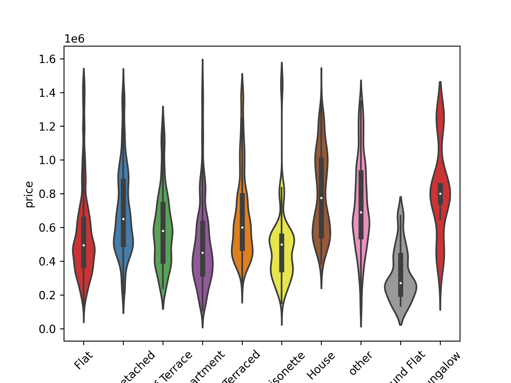
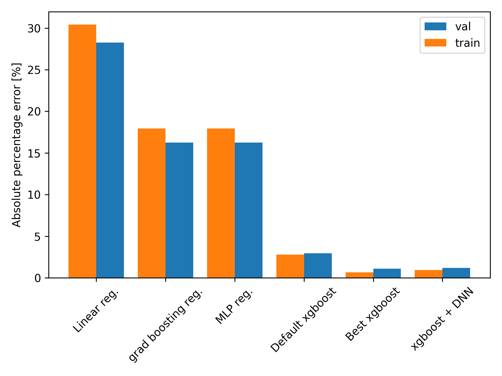

# London property price prediction

## Overiew 

In this project I scraped property information for around 22,000 properties in the London area from the website right-move. 
The end result was training models including a feedforward neural network with keras and a boosted regressor with xgboost, which achieved
a accuracy of around 1\% on the final test set.

Further details of the Project are below and in the notebooks (Last\_preprocessing\_and\_final\_analysis.ipynb and Scraping\_right\_move.ipynb)

## Motivation

I did this project as I lived a long time in London in the past. Additionally, I
wanted to do an end to end project involving data scraping.

## Data collection

In this project I collected data for around 22,000 properties (after data clearning) by scraping the UK property website right-move.

This included scraping key information such as the price, address, 
number of bedrooms and bathrooms, closest distance of train stations and the property 
type. In a addition I scraped the property plan images as these often contain text with
the area of the property. An example of this is shown below.

In order to perform the scraping I wrote two classes found in right\_move\_scraping.py
* RMScraper - scrapes the search pages of right move
* RMPageScraper - scrapes each property page

BeautifulSoup was used to parse the html and find the relevant information to be stored or downloaded (property plans).
Scraping was done in two steps scraping the urls of all properties for a given search query and then scraping all property pages. 
Properties were taken in the price range from 0.2m to 2m in pounds sterling. I stored all data using pandas dataframes and csv format for
further processing.

## Data cleaning and feature engineering

In addition, to cleaning up any text with python string functions and regular expressions, a major 
part of the data cleaning involved extracting text from the property plans. Here, I made use of 
openCV thresholding and pytesseract. I also converted all addresses to gpu coordinates using the google maps
api in python with the package googlemaps. This allowed me to engineer a key feature, the distance to central address in London, Picadilly
Circus, using geopy. 

## Data visualization 

I visualized the data using matplotlib and seaborn with a variety of data visualization techniques. For numerical features this included
plotting basic histograms and seaborn regression plots demonstrating the dependence of price on each of the features. Meanwhile, for categorical data such as
the property type I used seaborn violin plots to better understand the distribution of price for each property type. (see Last\_preprocessing\_and\_final\_analysis.ipynb)

  
  

  

The plot below summarises the dependence of several numerical features on one another.

In order to visulaize the dependence on GPS location. I plotted the properties on top of a map of london using geopandas. 
The price of the properties is represented by the size and hue of the points with larger and lighter in colour representing a
higher price. Clearly properties in central London in specific districts like Chelsea and South Kensington are higher in price. 

## Model building

Having split the data into train (~90%), test (~5%) and validation sets (~5%), I trained several models including:

* neural networks with scikit learn and tensorflow
* linear regression with scikit learn
* boost decision tree regressors with xgboost and scikit learn 
* xgboost boosted regressor optimized with GridSearchCV

The training and validation are shown for the tf neural network (5 layers each with 128 neurons, relu activations with l2 reg.):

A comparison of the performance of the models on the train and validation sets is shown below for a range of metrics including:
* the mean absolute error
* the r2 score
* the mean absolute percentage error

The xgboost regressor with optimal hyperparameters (tree depth =, learning rate =, number of trees) performs the best with the tensor flow neural network close behind.

  

  

  

## Final result

The optimized xgboost regressor achieves ~1% error on the test dataset and ~1% error on the validation dataset. Below the distribution of the absolute percentage error and the predicted house price vs the truth price scatter plot are shown.

  
  

